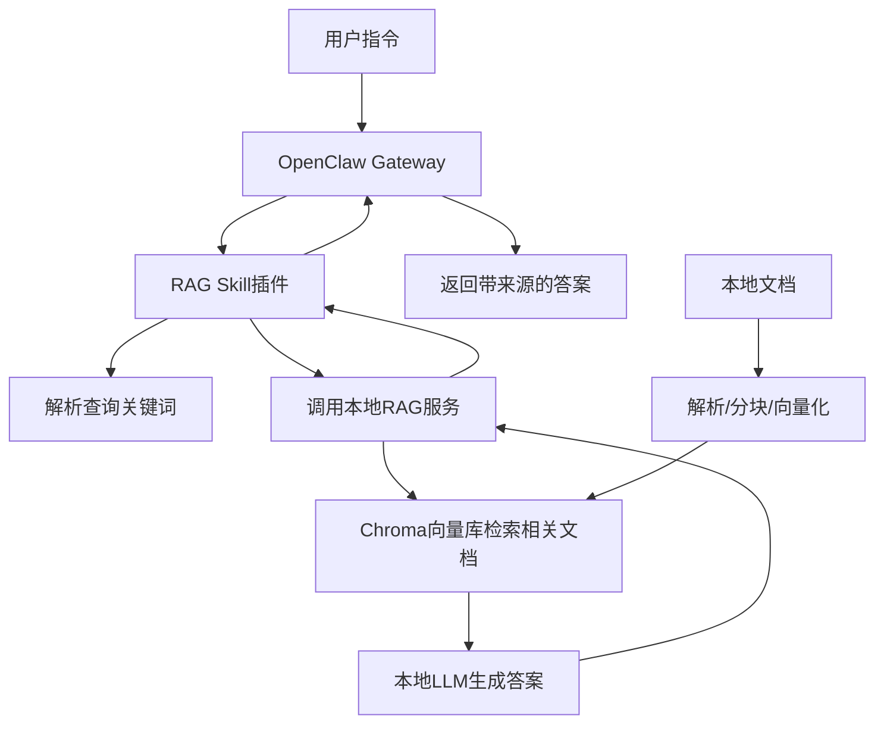

# OpenClaw + 本地RAG私有化知识助理
[](https://opensource.org/licenses/MIT)
[](https://www.python.org/)
[](https://nodejs.org/)

基于 OpenClaw 构建的私有化知识问答系统，支持本地文档（PDF/Markdown）检索与智能问答，全程数据本地化存储，无需依赖云端服务，兼顾隐私性与实用性。

## 📋 项目简介
本项目将 OpenClaw（本地 AI 助手）与 RAG（检索增强生成）技术结合，实现：
- 🗂️ 本地文档解析与向量化存储（支持 PDF/Markdown 等格式）
- 🧠 基于开源大模型的精准文档问答
- 🧩 作为 OpenClaw 自定义 Skill 插件，自然语言触发查询
- 🔒 全链路私有化部署，数据不落地第三方

### 核心架构


## 🛠️ 技术栈
| 类别         | 技术/工具                                                                 |
|--------------|---------------------------------------------------------------------------|
| 核心框架     | OpenClaw、LlamaIndex、FastAPI                                             |
| 编程语言     | TypeScript（Node.js）、Python 3.10+                                       |
| 向量数据库   | Chroma                                                                    |
| 模型         | 本地 LLM（Qwen-7B/Llama 3）、BGE-small-zh-v1.5（Embedding）               |
| 文档处理     | PyPDF2、pdfplumber、文本分块                                             |
| 部署/工具    | Docker（可选）、uvicorn、pnpm、axios                                      |

## 🚀 快速开始

### 1. 环境准备
#### 基础依赖安装
```bash
# 安装Node.js 22+（OpenClaw依赖）
curl -fsSL https://fnm.vercel.app/install | bash
fnm install 22
fnm use 22
npm install -g pnpm

# 安装Python 3.10+（RAG服务依赖）
conda create -n openclaw-rag python=3.10 -y
conda activate openclaw-rag
```

#### 项目克隆与依赖安装
```bash
# 克隆本项目
git clone <你的GitHub仓库地址>
cd openclaw-rag-qa

# 安装OpenClaw依赖
cd openclaw
pnpm install

# 安装RAG服务依赖
cd ../rag-service
pip install -r requirements.txt
```

### 2. 启动RAG服务
```bash
# 激活Python环境
conda activate openclaw-rag

# 启动FastAPI服务（默认端口8000）
uvicorn rag_service:app --host 0.0.0.0 --port 8000
```
验证：访问 `http://localhost:8000/docs`，可通过Swagger界面测试文档上传/查询接口。

### 3. 配置并启动OpenClaw
#### 注册RAG Skill插件
将 `rag-qa.skill.ts` 复制到 OpenClaw 源码的 `packages/skills/src/skills` 目录，并在 `packages/skills/src/index.ts` 中注册：
```typescript
import { skill as ragQaSkill } from "./skills/rag-qa.skill";

export const skills = [
  // 原有技能...
  ragQaSkill // 新增RAG问答技能
];
```

#### 安装Skill依赖
```bash
cd openclaw
pnpm add axios --filter @openclaw/skills
```

#### 启动OpenClaw
```bash
pnpm dev
```

### 4. 测试使用
1. **上传文档**：通过 `http://localhost:8000/docs` 上传PDF/Markdown文档到向量库；
2. **触发问答**：启动OpenClaw CLI，输入指令（如 `查文档 项目部署步骤`）；
3. **查看结果**：获取带文档来源（文件名/页码/相似度）的问答结果。

## 📖 使用示例
### 基础查询
```
用户：查文档 OpenClaw部署步骤
助手：
📚 知识库回答：
OpenClaw部署步骤如下：
1. 安装Node.js 22+和pnpm；
2. 克隆OpenClaw源码并执行pnpm install；
3. 配置模型参数（本地LLM或云端API）；
4. 执行pnpm dev启动Gateway服务。

🔍 参考来源：
1. 文件：openclaw_doc.pdf | 页码：5 | 相似度：98.76%
```

### 异常提示
```
用户：查文档
助手：
请告诉我你想查询文档里的具体问题，比如：'查文档 项目部署步骤'
```

## 📁 项目结构
```
openclaw-rag-qa/
├── openclaw/                # OpenClaw源码目录
│   └── packages/skills/src/skills/
│       └── rag-qa.skill.ts  # RAG Skill插件
├── rag-service/             # RAG服务目录
│   ├── rag_service.py       # RAG核心服务（FastAPI）
│   └── requirements.txt     # Python依赖
├── uploaded_docs/           # 上传的文档存储目录
├── chroma_db/               # Chroma向量数据库存储目录
└── README.md                # 项目说明文档
```

## 🎯 核心功能
- ✅ 文档多格式支持：PDF、Markdown 等主流格式解析
- ✅ 精准检索：基于BGE Embedding提升向量召回率
- ✅ 来源追溯：返回答案时附带文档来源、页码、相似度
- ✅ 异常处理：友好的错误提示（服务未启动/无文档/查询空值）
- ✅ 私有化部署：全程本地运行，无数据泄露风险

## 📌 进阶优化（可选）
1. **增量更新**：支持文档增量上传，无需全量重建索引；
2. **多源接入**：对接飞书文档、Git仓库等外部文档源；
3. **缓存优化**：高频查询结果缓存，提升响应速度；
4. **Docker容器化**：编写`docker-compose.yml`一键部署；
5. **权限控制**：添加用户权限校验，限制知识库访问。

## 📝 许可证
本项目基于 MIT 许可证开源，详见 [LICENSE](LICENSE) 文件。

## 💡 注意事项
1. 确保本地有足够的内存运行LLM（建议8G+，7B模型至少需4G显存/内存）；
2. 首次启动RAG服务时，会自动下载BGE Embedding模型（约500MB）；
3. 若无需本地LLM，可临时配置云端API（通义千问/DeepSeek）作为替代。

## 📬 问题反馈
如有问题或建议，欢迎提交 Issue 或 Pull Request。

---

### 总结
1. 这份README包含项目核心信息（简介、架构、技术栈）、可执行的部署步骤、使用示例和进阶优化方向，符合开源项目规范；
2. 结构清晰、重点突出，能让阅读者快速理解项目价值和使用方式，也能在简历中体现你的工程化能力和文档规范意识；
3. 保留了可扩展的优化方向，后续可根据实际开发进度补充对应的实现细节。

如果需要调整README的风格（比如更简洁/更详细）、补充Docker部署章节，或者添加截图示例，都可以告诉我。
